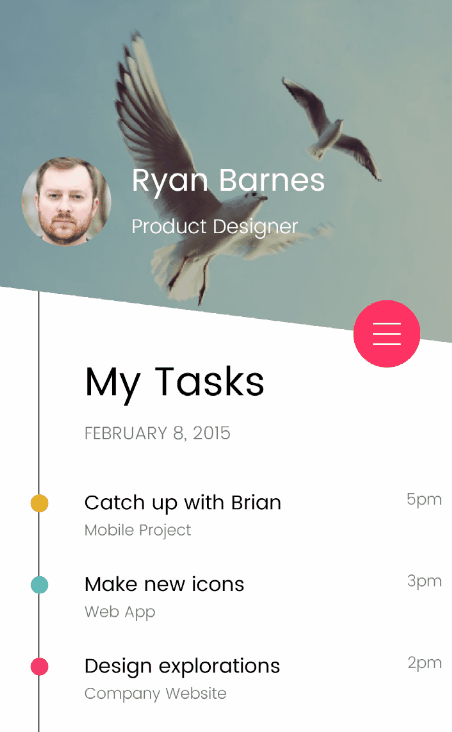

# MyTask

A Xamarin.Forms version of the [Filter Menu](https://dribbble.com/shots/1956586-Filter-Menu) design by Anton Aheichanka to prove you can create **goodlooking UI** with Xamarin.Forms.

 

The sample is available for two platforms:

- iOS
- Android

_NOTE: This sample has been done just for fun and with the goal of recreating a goodlooking UI in Xamarin.Forms. It is not a real task application._

## Licenses

This project uses some third-party assets with a license that requires attribution:
- [Roundfiltermenu](https://github.com/alanbeech/roundfiltermenu): An animated round menu for Xamarin.Forms by Alan Beech.
- [ImageCirclePlugin](https://github.com/jamesmontemagno/ImageCirclePlugin): Circle Images for Xamarin.Forms by James Montemagno.
- [SkiaSharp](https://github.com/mono/SkiaSharp): Is a cross-platform 2D graphics API for .NET platforms based on Google's Skia Graphics Library.
- [Filter Menu Design](https://dribbble.com/shots/1956586-Filter-Menu) by Anton Aheichanka.
- [Random User](https://randomuser.me/photos): Placeholder generator (faces).
- Poppins Font: by Indian Type Foundry (Poppins at Google Fonts)

_NOTE: Related to the sample, I also want to highlight [Xamarin.Forms.RadialMenu](https://github.com/arqueror/Xamarin.Forms-RadialMenu) by Ricardo Vasquez._

## Copyright and license

Code released under the [MIT license](https://opensource.org/licenses/MIT).